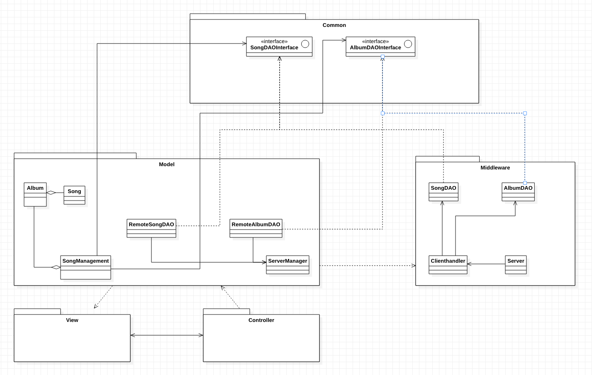

# 506_Middleware

## Einleitung
In den bisherigen Ausbaustufen erfolgt die Persistierung auf dem Computer, der die JavaFX-GUI ausführt. In dieser Ausbaustufe soll die Datenhaltung zusätzlich auf einem entfernten Computer, der über das Netzwerk erreichbar ist, stattfinden können. Auf diesem entfernten Computer – dem Server (= Middleware) - sollen die erstellten DAO-Klassen in der gleichen Art und Weise zum Einsatz kommen, wie dies bereits im lokalen Model der Fall war.

Es erfolgt nun eine Aufteilung in 2 Hauptbereiche:
- Model (Client-SW = lokal) und  
- Middleware (Server-SW)

Der dritte Bereich (= Common) besteht aus den Interfaces, die beiden Bereichen bekannt gemacht werden müssen.

## Aufgabe Middleware (Server-SW)
- Erstelle eine Server-SW, welche auf einem zu konfigurierenden Port ( .properties-Datei) - auf Verbindungsanfragen horcht und diese entgegennimmt (Klasse `Server`).
  - Die angenommenen Verbindungen sollen über einen – ebenfalls zu erstellende Klasse `Clienthandler` -  bedient werden.
  - Hierbei ist auf gleichzeitige Bedienung mehrerer Clients zu achten (und auch auf damit verbundene Probleme – Stichwort: "threadsafe").
- Der `Clienthandler` gibt dann die empfangenen Kommandos und Daten (siehe Aufgabe Protokoll) an die `DAO`-Objekte `SongDAO` und `AlbumDAO` weiter.
  - `SongDAO` und `AlbumDAO` befinden sich jetzt nur mehr auf der Serverseite und übernehmen, wie bisher, das Speichern und Laden aus der Datenbank. (Werden unverändert weiterverwendet).

## Aufgabe Protokoll
- Für die Kommunikation zwischen Client und Middleware ist ein entsprechendes Protokoll zu definieren.
  - In diesem muss festgelegt werden, wie die Anfragen und wie die Antworten aufgebaut sind.
  - Es muss dabei unbedingt auf die Behandlung von Fehlersituationen geachtet werden.
  - Exceptions werden beispielsweise nicht automatisch über die Verbindung transportiert, wie dies sonst bei Methodenaufrufen der Fall ist.

## Aufgabe Model (Client-SW)
- Auf dem Computer, auf dem die JavaFX-Oberfläche ausgeführt wird – dem Client also – sollen zusätzliche DAO-Klassen `RemoteSongDAO` und `RemoteAlbumDAO`  realisiert werden.
  - Sie müssen die bereits vorhandenen Interfaces (`SongDAOInterface` und `AlbumDAOInterface`) implementieren.  
- Die bisherigen Instanzen `SongDAO` und `AlbumDAO` im `SongManagement` werden durch Instanzen dieser Remote-Klassen ersetzt.
- Die `RemoteDAO`-Instanzen übernehmen die Kommunikation mit der Server-SW über Sockets.
  - In den zu überschreibenden Methoden (z.B. `insert, …`) sollen die erhaltenen Parameter (`Song`, `Album`, …) verpackt und an den Server (d.h. an den verbundenen `Clienthandler`) übertragen werden.
- Die Antwort des Servers wiederum soll in den `RemoteDAO`-Instanzen entgegengenommen werden.
  - Aus dieser Antwort sollen die Objekte (`Song`, `Album`) extrahiert und in gewohnter Weise an das `SongManagement` übergeben werden.
  - Achtung: Das `SongManagement` bleibt unverändert!
