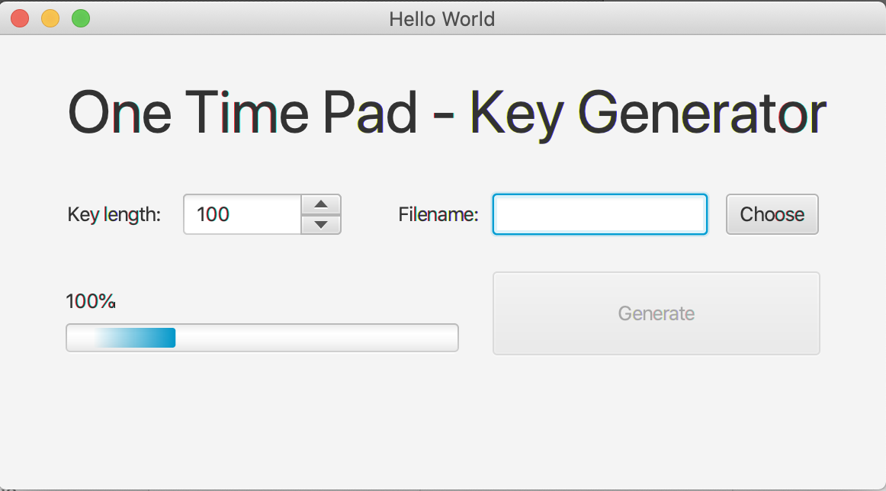
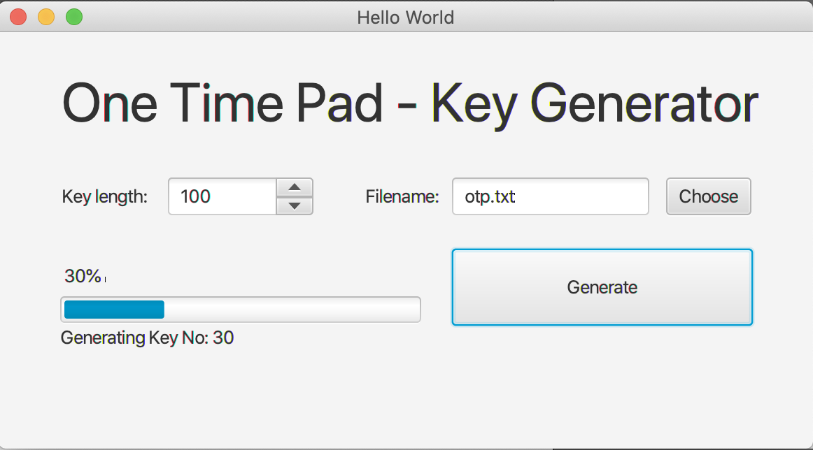

# One Time Pads

One-Time Pads wurden bereits im 19. Jahrhundert erfunden und werden seit dem Kalten Krieg zur Verschlüsselung von Geheimnachrichten eingesetzt. 

Sie gelten nach wie vor als absolut unknackbar.

Das Verschlüsselungsverfahren ist dabei aber sehr simpel: 

- Der Schlüssel muss gleich lang wie der zu verschlüsselnde Text sein. 
- Durch eine simple Addition der einzelnen Buchstaben von Schlüssel und Klartext entsteht der verschlüsselte Text.
- Bei Binärdaten könnte man die Daten einfach mit XOR verknüpfen.
- Jeder Schlüssel darf nur einmal verwendet werden und muss aus zufälligen, gleichverteilten Buchstaben/Bytes bestehen. 
- Sender und Empfänger müssen gleichermaßen über denselben Schlüssel verfügen.

##Anforderungen / Beurteilung

Entwickle ein JavaFX Programm zur Erstellung von One Time Pads für die Verschlüsselung von Textdateien.

- Der User muss folgende Daten eingeben:
    - Dateinamen für das OTP
    - Schlüssellänge (100 - 10.000)
    
- Das Programm erstellt daraufhin den Schlüssel (Textdatei mit zufälligen Buchstaben von A-Z) mit der angegebenen Schlüssellänge

### Programm beim Start:


### Programm während der Key-Berechung:


### Programm nach der Key-Berechnung:


## Gesamt (  /  20 + 3)

## GUI ( / 5 + 1)
- ( / 3) Erstelle die GUI gemäß der Vorlage
- ( / 2) Halte dich an das MVC Pattern!
- ( / 1) BONUSPUNKTE: Dateiname wird über FileChooser eingegeben

## Bindings ( / 5 + 2) 
- ( / 1) Generate darf erst aktiviert werden, wenn Keylength einen Wert hat und ein File ausgewählt/eingegeben wurde
- ( / 1) die Progressbar muss mit dem Fortschritt der Berechnung "gekoppelt" werden
- ( / 2) StatusText (unterhalb Progressbar): 
    - Während des Berechnens: "Generating Key No. 30"
    - Nach Fertigstellung: "Finished"
- ( / 1) Sobald die Berechnung fertig gestellt wurde, ist der Dateiname zu löschen!
- ( / 2) BONUSPUNKTE: Prozentanzeige während des Laufs (oberhalb Progressbar)

## Schlüsselerzeugung ( / 10)
- ( / 2) Die Schlüsselerzeugung läuft als Thread
- ( / 1) Drücken auf "Generate" startet die Schlüsselerzeugung erneut (auch während eines Laufs)
- ( / 1) aktualisiere Statustext und Fortschritt
- ( / 3) Berechnen des Schlüssels (nur Großbuchstaben A-Z - ASCII: 65-90)
- ( / 3) Speichern des Schlüssels (Zeichen für Zeichen) in die Textdatei


## Hinweise / Sonstiges:

### Key length:
Verwende für die Eingabe der Länge einen Spinner. Benutze folgenden Code im Controller:

```   
   @FXML
   private Spinner<Integer> lengthSpinner;
   ... 
  
   @FXML
    public void initialize() {
      lengthSpinner.setEditable(true);
      lengthSpinner.setValueFactory(new SpinnerValueFactory.IntegerSpinnerValueFactory(100, 10000));
       ...
    }
```

Alternativ könntest du für die Key Length auch ein `TextField` verwenden.

### Dateiname:
Für die Auswahl des Dateinamen würde sich der FileChooser anbieten. Folgender Code steht dabei in deinem Controller bzw. in der Ereignisbehandlung des "Choose" - Buttons:

```
   private FileChooser fileChooser;
   private File otpFile = null;
   ...

   @FXML
   void onChooseFileName(ActionEvent event) {
      // generate FileChooser Dialog
      fileChooser = new FileChooser();

      // get current Stage from an GUI Element - in this case use the TextField "fileNameTextField"
      Stage stage = (Stage) fileNameTextField.getScene().getWindow();

      // Title for FileChooser Dialog
      fileChooser.setTitle("Save OTP Key");
      // set Filter for Files
      fileChooser.getExtensionFilters().addAll(
              new FileChooser.ExtensionFilter("All Files", "*.*"));
      // show the FileChooser Dialog and get the chosen File as "File-Object"
      otpFile  = fileChooser.showOpenDialog(stage);

      // sets the Textfield with the 
      fileNameTextField.setText(otpFile .getName());
   }
```

Alternativ könntest du den Dateinamen auch in einem `TextField` eingeben

 ## Abgabe:
 - erstelle ein Projekt auf `Z:\Schule` mit dem Namen: 299_PLF_Nachname
 - lösche vor der Abgabe alle Dateien im Projektlaufwerk AUSSER `src`
 - Zippe den Ordner `299_PLF_Nachname`, du erhälst `299_PLF_Nachname.zip`
 - gib die Zip-Datei am Lehrer Laufwerk unter `HELT\Abgabe_SA\Klassenname` ab